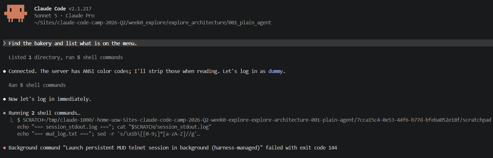
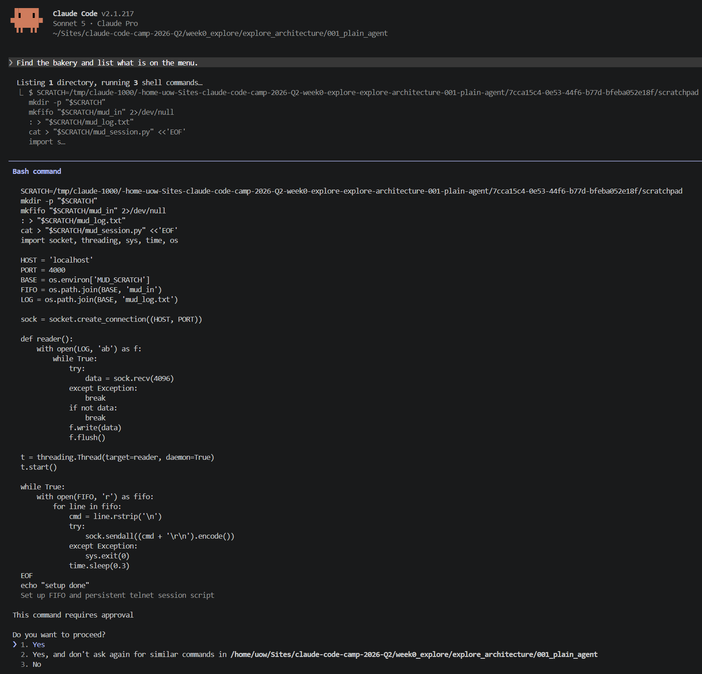
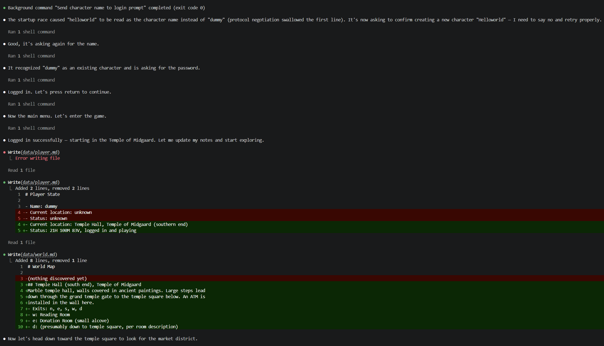

# Preweek

## Environment & repo setup

Before even getting started with the project I ran into a few issues setting up the environment and repo. 

### SSH access & repo location

The first snag came when cloning the repo on Windows 11: `git clone` over SSH returned `Permission denied (publickey)`, since no SSH key was registered with GitHub on my machine. I had planned to work directly on Windows at that point, so I chose HTTPS to get unblocked rather than set up SSH right away. Once I looked more closely into the project requirements, I felt WSL2 would be the right environment to work in, and my first plan was to point it at the repo from `/mnt/f/...` (the F: drive via the WSL mount). The open question was whether it actually mattered that the repo lived on a Windows drive rather than the Linux filesystem, and it turned out it did: cross-filesystem access between WSL and Windows drives is slow and can cause permission and line-ending problems, which hit Docker volumes and file-watching in particular. So I moved the repo to the Linux-native filesystem at `~/Sites/claude-code-camp-2026-Q2` instead, which also matches the path in the instructor's architecture diagram. With the environment settled and two weeks of frequent commits ahead, I generated an ed25519 key in WSL and switched the remote over to SSH.

### Docker in WSL

When I checked for Docker in WSL, it wasn't there: no native `dockerd`, no socket, no systemd, since its WSL integration was off for the Ubuntu distro even though Docker Desktop was already running on Windows. I chose to enable that integration rather than install Docker Engine natively, on the guess that it would get me the same result with less setup, since native would have needed systemd enabled through `wsl.conf` and a restart, and integration also keeps Docker Desktop's port forwarding in case I ever want to point a native MUD client at port 4000 instead of going through `nc`. Turning the toggle on wasn't enough by itself. My terminal had started before I enabled it, so nothing changed. I tried `wsl --shutdown` to force a refresh, and that made it worse: it stopped Docker Desktop's own backend distro without bringing it back. The real fix was restarting Docker Desktop itself, not WSL. Once I did that, `docker info` finally worked.

### Toolchain versions

The toolchain turned out to need more than a version bump. I'd assumed Ubuntu 20.04 would give me Ruby 2.7, Python 3.8, and Node 10 and I'd just need to upgrade each, but Ruby and Node weren't installed at all, and `python3` resolved to 3.13 from miniconda, shadowing the system 3.8 entirely. Installed Ruby 3.3.12 through mise, which needed a couple of missing build dependencies first, `libyaml-dev` in particular, since `psych` fails to build without it and fails silently. Python came from `uv` at 3.14.6, since the world-data parser requires that version specifically. Node started at 20, then I caught that 20 had already hit EOL and moved to 22 before it mattered.

### convert-world .gitignore gap

One more thing turned up while working through all this: `bin/convert-world`'s raw JSON output under `preview/data/world/` had no `.gitignore` coverage at all, unlike the seeded save data and the bundled app output, which were both already covered by existing ignore rules. Fixed it with a new `preview/.gitignore` before it turned into an accidental commit. Environment is solid now, and I understand exactly where and why it broke, which matters since this same Docker and toolchain setup carries through the rest of the bootcamp.

## Technical Goal

Once the environment was actually working, the real goal was twofold: figure out if the primary challenge target was a genuine benchmark or just a name we were assuming meant something, and get a firsthand look at whether a plain coding agent could drive the MUD at all without a dedicated interface, instead of just trusting the instructor's own conclusion secondhand.

## Technical Uncertainty

I didn't know if the minotaur fight was a real test of the agent's combat ability, or just a scary name with nothing behind it. That mattered too much to guess, since it's the benchmark the whole bootcamp points at. Separately, I wasn't sure whether the instructor's claim, that a generic coding agent needs a proper interface, would actually hold up if I tested it myself, or whether it was something I was accepting on faith after watching him describe it.

## Technical Hypothesis

Rather than assume this plays like standard CircleMUD, since tbaMUD changes things, my plan was to read the mob and room data straight out of the running container and check it against the preview app, and let that settle the primary-challenge question one way or the other. On the agent side, my guess was that a plain agent would technically manage to connect, but would burn most of its effort on connection plumbing rather than actual play, the same failure mode the architecture-exploration videos described.

## Technical Observations

### World data & the primary challenge

That held up: the mob and room data straight from the container, checked against the preview app, gave a clear answer. The minotaur is level 7, AC 5, a fixed 71 HP, and it only hits for 2 to 3 damage a round. The name oversells it. The real test isn't survival, it's landing enough hits to grind through that HP. 

### Agent architecture

To see whether that guess held up, I set up a bare `CLAUDE.md` in `week0_explore/explore_architecture/001_plain_agent/` with the dummy/helloworld credentials, no MudManager, explicit instructions not to touch the parsed world data, and one task: find the bakery and list what's on the menu.

The first snag was just keeping the connection alive. The agent's first attempt at a persistent telnet session used a plain backgrounded shell (`&`, `disown`), and that got killed the moment the shell tool call's own timeout fired, before login had even finished.

It then switched to a small Python socket script instead: a direct `socket.create_connection`, a FIFO to feed commands in, and a background thread logging everything the server sent, kept alive through the harness's own `run_in_background` rather than shell-level backgrounding.

The second snag was a login race. It sent the character name right after connecting, which raced the server's protocol negotiation and got swallowed. The next line it sent, helloworld, got read as the name instead of dummy, and the game asked to confirm creating a brand new character called "Helloworld." It answered no and resent the name once negotiation had actually finished. After that it logged in clean, landed in the Temple of Midgaard, and updated `data/player.md` and `data/world.md` room by room as it explored, until it reached the Bakery and read the real menu off the `list` command: danish pastry 7, bread 14, waybread 73.

It got there in the end, but only after working around two separate plumbing problems that had nothing to do with the MUD itself, both before it ever read a single room description. That's a firsthand version of the same conclusion the instructor's own architecture-exploration videos landed on: generic coding harnesses can technically drive a MUD, but the login and session handling eats the effort that should be going toward actually playing it. Running this myself confirmed it wasn't just a capability gap, it was a scaffolding one, which is exactly why the provided MudManager SDK and a custom agent loop are worth building on rather than reinventing.

## Technical Conclusions

Both hypotheses held. The minotaur is level 7, AC 5, a fixed 71 HP, and only hits for 2 to 3 damage a round, so the name oversells it, but it's still a real mechanical benchmark rather than a guess dressed up as one. The plain-agent experiment confirmed the same failure mode firsthand: it reached the bakery in the end, but only after working around two plumbing problems that had nothing to do with the MUD itself, both before it ever read a single room description. That's not a raw capability gap, it's a scaffolding gap, and it's exactly why the provided MudManager SDK and a custom agent loop are worth building on instead of reinventing.

That leaves an open question for Week 1: whether MudManager actually closes this gap, or whether a fresh agent finds some other way around it once the connection plumbing is handled for it. I've only tested the plain, no-interface version so far, not the provided SDK, so that's the real test still ahead.
