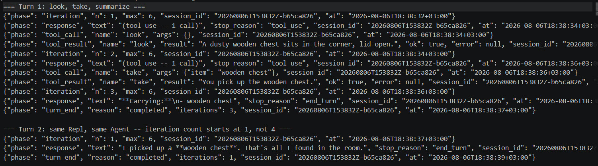
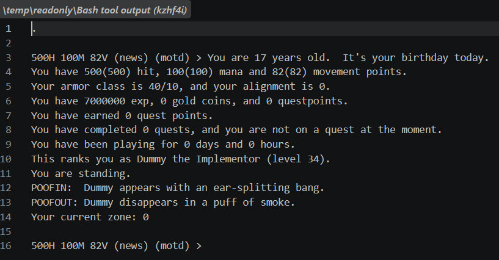
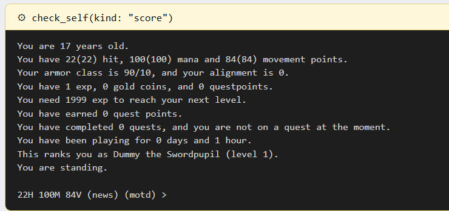
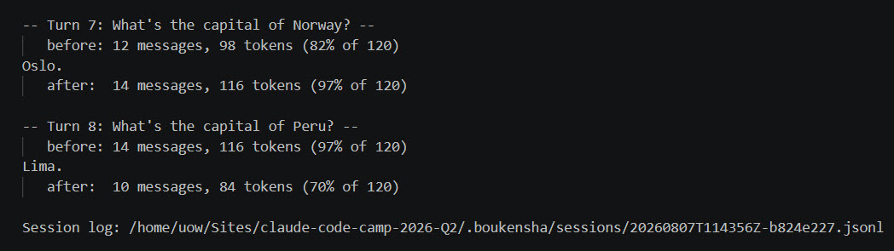
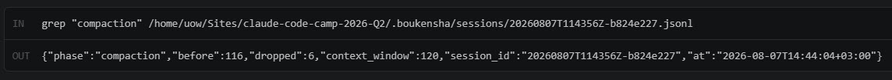

# Week 1

## Technical Goal

I went through the instructor's videos and reviewed his live repository to see how his implementation had progressed since the template was created, since that would tell me what actually worked for him and what I could safely skip. From that, my goal was to build a working baseline agent, all twelve components, by understanding his reference well enough to write my own version rather than port his, and to prove it actually plays the MUD, not just that it passes tests.

## Technical Uncertainty

I didn't know whether building independently instead of porting would actually produce a working agent in the time available, or whether the components would turn out to depend on details only visible in his exact code. I also didn't know whether the provided MudManager SDK would work as-is, given the preweek finding that a plain coding agent needed real scaffolding just to hold a MUD connection at all.

## Technical Hypothesis

Since I decided to build my own implementation, I set one condition going in: if I couldn't get a working agent this way, I'd switch to a straight lockstep port and journal why.

## Technical Observations

### Not carrying forward the registry bug

Building the registry step, I found the instructor's own reference had an issue: his Registry sits on top of Context, but Context still held the tools hash directly underneath it, so the registry ended up a thin facade rather than the actual owner. He caught this himself and called it a genuine defect, and said he planned to fix it in Week 2, but never did in Week 1. I decided to skip this entirely, so now Context here has no tools field at all, Registry is the only place tool storage lives.

### Deciding not to use MCP

I decided to skip MCP entirely for Week 1. In the instructor's build, its whole reason for existing was letting a Python port reach his Ruby-only MudManager. I'm building in Ruby only, so it buys me nothing and would cost a refactor he himself calls "worth watching but not doing". He built MCP to demonstrate how the reference implementation could be ported into Python or another language, letting a non-Ruby agent still reach his Ruby-only MudManager. That's a portability exercise, not something my build needs to solve, since I'm staying in Ruby end to end. Worth revisiting in Week 2 if I ever need a real cross-process boundary of my own.

### First real call out of the process

Everything up to this step ran without touching the network. Building the API client changed that, since it's the first place a request actually leaves the process and a real model answers back. I didn't want to trust the retry and backoff logic on faith, so I wrote a small raw TCP server, stdlib only, no mocking gem, that queues up canned HTTP responses and records exactly what got sent to it. That let me prove a 503 followed by a 200 actually retries and recovers, four straight 503s exhaust the retry budget and raise, and a closed port produces a real connection-refused error rather than a simulated one. Then I ran the example against the real Anthropic API: sent "look around," the model called my one registered tool, the tool actually ran, and a second call came back with a real answer built from the result. First point in the whole build where the request-to-model-to-tool-to-response cycle was proven end to end, not just unit tested in isolation.

### Session Logs - ignore or keep

Earlier on, the instructor said session logs should be committed, not gitignored, since he uses them to check that submitted work actually ran. Later on Discord he said that wasn't necessary anymore as it was becoming too much to manage. When I checked his current repo, it confirmed this: `.boukensha/.gitignore` now excludes runtime session logs, with his own comment that they "bury real changes in the diff" and are "reproducible only by playing." The one exception is a small folder of pinned test fixtures he promotes on purpose. After seeing this, I decided to curate as I go along and keep the best ones, rather than committing everything and running into the same issue as he did. The curated logs are committed under `.boukensha/sessions/`, one per step from step 06 through step 12, each the clearest run showing that step's own new capability rather than every run.

### A green checkmark that was checking nothing

Verifying the logger against log_viz, the provided viewer, I pointed BOUKENSHA_DIR at the repo and started it up. The index page loaded fine, 200 OK, and I almost called that good. It wasn't. log_viz has its own separate env var for where session logs live, doesn't read BOUKENSHA_DIR at all, and was silently listing zero sessions from a directory that doesn't even exist. A 200 status code told me the server was up, not that it found anything. I only caught it by actually opening a session in the browser and checking the page had real content, not by trusting the first green light. Worth remembering as a pattern, not just a one-off: "it returned success" and "it did the thing I meant" are different claims, and the gap between them is exactly where a real bug can hide.

### A class that existed for seven steps before anything called it

Tasks::Player has been sitting in the codebase since step 00, built to resolve provider, model, and system prompt from settings.yaml, but every example up to this point just passed those values in directly instead. It took until the run DSL step, where I actually wanted settings.yaml to be the source of truth instead of a hardcoded script, for it to have a real caller. Small thing, but a good reminder that writing a class and using it aren't the same milestone, and it's worth noticing the gap rather than assuming something's dead just because nothing's called it yet.

### The efficient choice uncovered a bug

The reference REPL rebuilt a fresh Agent every single turn, something the instructor himself called a defect and left alone. I built the REPL sharing one Agent across every turn instead, since that was the better design. Doing it that way surfaced a bug the other version could never have. The iteration counter only ever went up, never reset, so a second turn on a reused Agent would inherit whatever count the first turn left behind. A fresh object every turn always started at zero, so the reference's version had been accidentally shielding it from a bug that only showed up once I fixed the inefficiency. One line fixed it, but it wouldn't have been visible at all without choosing the better design first. Same pattern again a few minutes later, this time smaller: a test using a whitespace-only input line caught that I was using .chomp instead of .strip to check for blank input, so " " wasn't being treated as empty and would have sent a real API call for nothing.

### Leaving out some machinery

The reference added a config file and env var at the global-executable step purely so the instructor could switch between his own thirteen parallel dev gem versions while recording. Since I only had one, adding that machinery here would have been irrelevant. So I left it out and shipped one plain gem instead. Same instinct as skipping MCP earlier.

### Proving the gem actually works

Once I had the executable working, I didn't stop till the test suite was green. I built the gem, installed it, then deliberately ran it from /tmp using the installed binary's full path so there was no way it could coincidentally resolve to something in the working directory instead of the actual installed gem. Both a real --version check and a real live task worked from there. Small thing, but it was the same lesson as the log_viz 200-status mistake a few steps back: a test suite proves the code is correct in isolation, it doesn't prove the deliverable does what it claims to do in the world, and those were worth checking separately.

### dummy turned out to be a god

Starting the MUD tool library, I tested MudManager's login against the real container instead of assuming it worked, and it failed immediately. TBA MUD sends a "Did I get that right, Name (Y/N)?" confirmation for any name the server has never seen before logging asks for a password at all, and Session#login had no idea that prompt existed, it just timed out waiting for a password prompt. Working through it by hand to see the real sequence, I found dummy wasn't actually a registered character in this container at all, even though a dummy.plr file existed on disk from Preweek. Creating it fresh hit a second, bigger surprise: CircleMUD auto-promotes the first character ever created in an empty player database straight to level 34, full god. dummy became "Dummy the Implementor" by accident, exactly the trap HOW_TO_PLAY.md warns about and I'd read past.

Fixing that took more circling than I expected. Demoting dummy from within its own session got refused since CircleMUD won't let a god self-target with advance. Creating a second character to do it instead required that second character be promoted first, which needed the right command (a similarly-named argument turned out to be a different, unrelated field, the real command was plain advance), and even a same-level god got refused targeting another one. set player level finally moved the number, but left HP, exp, and title still god-shaped, level 1 with 500 HP and a broken negative exp counter wasn't a real mortal. The only way to get dummy's stats genuinely clean was deleting the character files entirely, stopping the container first since editing them while the server holds its own in-memory copy risks the server clobbering the edit, then recreating dummy fresh now that a second character already existed to absorb the first-in-database promotion.

Separately, fixing Session#login for the Y/N gap surfaced that the provided live_session_test.rb had never actually passed with real credentials either, it calls login with a timeout: keyword the method doesn't accept. I left that one alone since our own tool layer doesn't call login that way, but it's worth noting the provided test suite for MudManager was never green to begin with, not something I broke.

### Skipping the TUI

I decided not to build the Bubble Tea terminal UI from step 11. The instructor explained in an office-hours session that the TUI polling every 60 seconds was the single biggest cost in his loop. Turning it off took "find the bakery" from five to seven minutes down to 31 seconds, and his own conclusion was that "the justification for one just doesn't really seem there" once a log viewer already exists.

### Getting compaction to actually fire took two tries

There's no automatic compaction when calling the API directly, so I built that myself in step 12: token tracking, a second circuit breaker alongside max_iterations, and auto-compaction that kicks in once usage crosses a threshold. I didn't want to trust it just because the code looked right, so I built the example to actually force it live instead of asserting it in a test and moving on. The first attempt used an 800 token window, ran four real turns, and only got to 9 percent, nowhere close. The second attempt dropped it to 120 tokens over six turns and still only hit 82 percent, still under the 85 percent threshold. The third attempt kept the same 120 token window but ran eight turns, crossed to 97 percent by turn seven, and turn eight opened with compaction actually running: message count dropped from 14 to 10 before that turn's request ever went out, logged as a real event, not a simulated one. Two wrong guesses at the window size before finding one that actually proved the mechanism instead of just running without errors.

## Technical Conclusions

The one condition I set going in, fall back to a lockstep port if I couldn't get a working agent my own way, never triggered. Twelve steps in, the agent connects to a real MUD, plays as a real mortal character, calls real tools, tracks and compacts real token usage, and every step is backed by tests plus at least one live run against the real API or the real game. The decisions to skip MCP, the TUI, and the instructor's own multi-gem switching machinery all held up, none of them turned out to be something this build actually needed.

Week 2 is about observability, seeing what the agent is actually doing step by step, not just whether the final answer looks right. Going in, my plan is to start by capturing what's actually happening at the source, raw telnet traffic, individual tool calls, and per-request token usage, rather than inferring it from logs after the fact.
